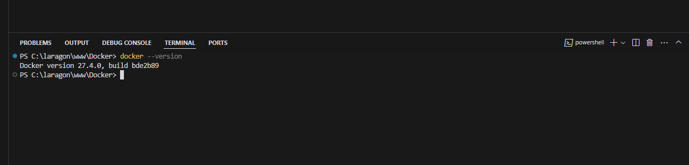
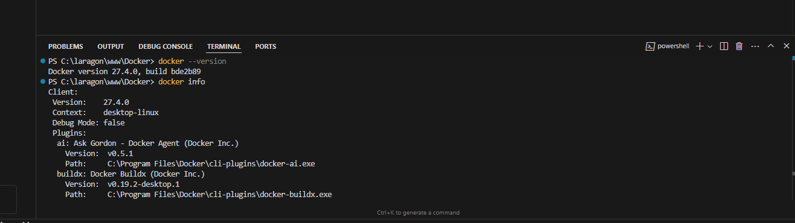
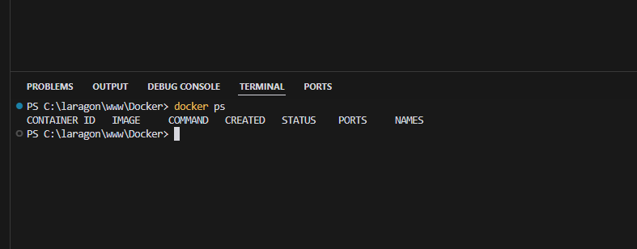
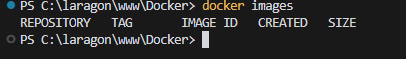
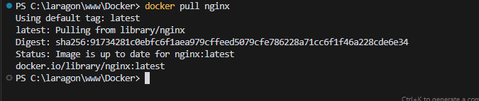
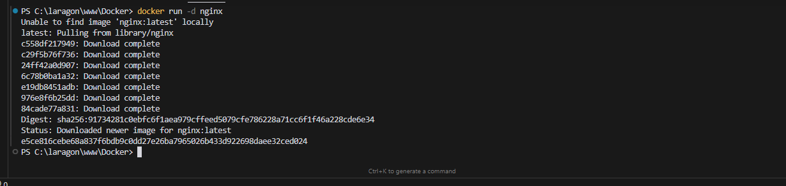
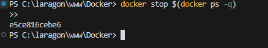
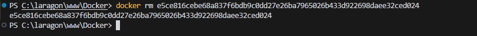

# 🐳 Runtrack Docker - Jour 1 | Job 01

## 📋 Table des Matières
1. [Vérification de l'Installation](#1-vérification-de-linstallation)
2. [Commandes de Base](#2-commandes-de-base)
3. [Gestion des Images](#3-gestion-des-images)
4. [Création et Gestion des Conteneurs](#4-création-et-gestion-des-conteneurs)
5. [Commandes de Suppression](#5-commandes-de-suppression)
6. [Bonnes Pratiques et Astuces](#6-bonnes-pratiques-et-astuces)

## 1. Vérification de l'Installation

### Vérification de la Version Docker
```bash
docker --version
```


**Résultat:** Docker version 27.4.0, build bde2b89

## 2. Commandes de Base

### 2.1 Information Système
```bash
docker info
```


### 2.2 Liste des Conteneurs Actifs
```bash
docker ps
```


### 2.3 Liste des Images
```bash
docker images
```


## 3. Gestion des Images

### 3.1 Téléchargement de l'Image Nginx
```bash
docker pull nginx
```


### 3.2 Vérification Post-Téléchargement
```bash
docker images
```


## 4. Création et Gestion des Conteneurs

### 4.1 Création d'un Conteneur Nginx
```bash
docker run -it --rm --name first-container -p 8080:80 nginx
```


**Paramètres expliqués:**
- `-it`: Mode interactif avec terminal
- `--rm`: Suppression automatique à l'arrêt
- `--name first-container`: Nom personnalisé
- `-p 8080:80`: Mappage du port (local:conteneur)

### 4.2 Accès au Conteneur
- URL: `http://localhost:8080`
- Test dans le navigateur pour voir la page par défaut Nginx

### 4.3 Arrêt du Conteneur
**Mode Interactif (-it):**
- Utiliser `CTRL+C`
- Le conteneur est automatiquement supprimé (--rm)

**Mode Détaché (-d):**
```bash
docker stop first-container
```


## 5. Commandes de Suppression

### 5.1 Suppression de Conteneurs
```bash
# Un conteneur spécifique
docker rm first-container

# Plusieurs conteneurs
docker rm container1 container2

# Tous les conteneurs arrêtés
docker container prune

# Forcer la suppression
docker rm -f container_name
```


### 5.2 Suppression d'Images
```bash
# Une image spécifique
docker rmi nginx

# Plusieurs images
docker rmi image1 image2

# Images inutilisées
docker image prune -a

# Toutes les images (forcé)
docker rmi -f $(docker images -aq)
```

## 6. Bonnes Pratiques et Astuces

### 🎯 Points Clés
1. **Nommage des Conteneurs**
   - Utilisez `--name` pour faciliter la gestion
   - Exemple: `--name my-nginx`

2. **Gestion des Ports**
   - Évitez les conflits de ports
   - Vérifiez les ports disponibles avant mapping

3. **Mode Détaché vs Interactif**
   - `-d`: Pour les services en arrière-plan
   - `-it`: Pour le développement/debugging

### ⚠️ Précautions
1. **Avant Suppression**
   - Vérifiez les conteneurs dépendants
   - Sauvegardez les données importantes

2. **Utilisation de --force (-f)**
   - À utiliser avec précaution
   - Peut causer des problèmes de ressources

### 🔍 Commandes de Diagnostic
```bash
# Logs du conteneur
docker logs first-container

# Processus en cours
docker top first-container

# Statistiques en temps réel
docker stats

# Informations détaillées
docker inspect first-container
```

## 🔗 Ressources Utiles
- [Documentation Docker](https://docs.docker.com/)
- [Hub Docker](https://hub.docker.com/)
- [Documentation Nginx](https://hub.docker.com/_/nginx)

## 📝 Notes
- Assurez-vous d'avoir les droits administrateur
- Gardez Docker Desktop à jour
- Surveillez l'utilisation des ressources
